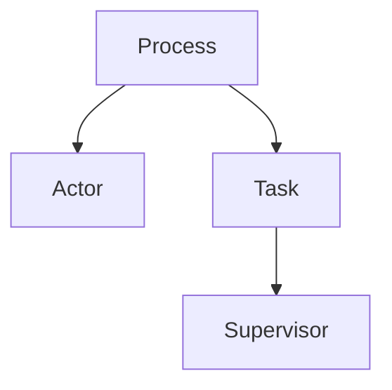

ErlangのOTPフレームワークを使うと、耐障害性の高いアプリケーションを楽に開発できる。
ここではGleamからOTPフレームワークを使い、そのようなアプリケーションを作る方法をメモしていく。

## GlemeからOTPにアクセスする

GleamにはOTPフレームワークを扱うためのライブラリがある。
[リポジトリ](https://github.com/gleam-lang/otp)

これを使うことでSupervisorなどの機能にアクセス出来る。

## 用語の整理

### Process
OTPの最下位の構成要素で、他のアクターは全てプロセス上に構築される。しかしProcessはGleamではあまり使われず、より多くの機能を提供する他のアクタータイプが使われる。

詳しくは[ここ](obsidian://open?vault=note&file=article%2FGleam%2FProcess)を参照。

### Actor
Gleamで最も一般的に使用されるインターフェース。ErlangのGenServerと同様に、OTPからのメッセージを自動的に処理する。
GenServerなどの名称を使っていない理由は、GleamのActorはGenServerと違い型付けされたAPIを提供していて大きく違うかららしい。

詳しくは[ここ](obsidian://open?vault=note&file=article%2FGleam%2FActor)を参照。

### Task
単一のタスクを実行してからシャットダウンするプロセスの一種。タスクは、プログラムを並列化することによって逐次的な処理を並列処理にするために使われる。Actorと違ってプログラム実行中に動的に生成される。

詳しくは[ここ](obsidian://open?vault=note&file=article%2FGleam%2FTask)を参照。

### Supervisor
`Process`のグループを開始して監視し、クラッシュした場合には`Process`を再起動する。`Supervisor`は`Supervisor`を管理することができ、階層上の`Process`を構築することでGleamプログラムの耐障害性を高めることができる。

詳しくは[ここ](obsidian://open?vault=note&file=article%2FGleam%2FSupervisor)を参照。

公式のトップにある階層図は以下のようになっている。

## 実際の使用例
リポジトリの`test`モジュールにあるプログラムが確実に動くサンプルとして有効。