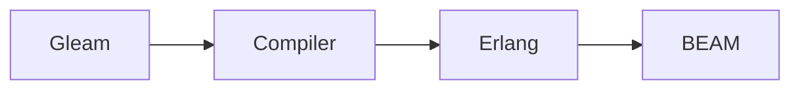

ホームページ: https://gleam.run

## Gleamとは？
- 耐障害性を持つ
- 静的型付けな
- 関数型言語

## 言語処理系

```mermaid
graph LR
A[Gleam]-->B[Compiler]-->C[Erlang]-->D[BEAM]
```

Rustで書かれたコンパイラによってErlangのソースに変換され、それがErlang VM(BEAM上で実行される)