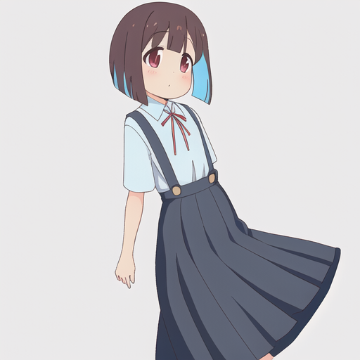
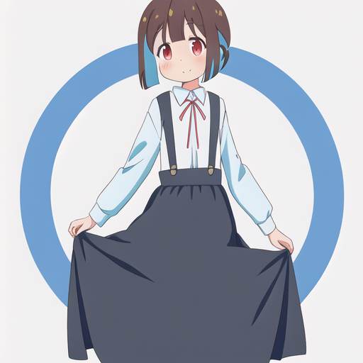
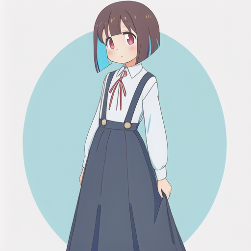
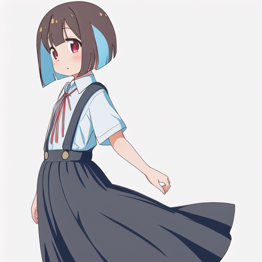

[[Stable Diffusion/AIノート]]が長くなったので、もみじちゃんAIについてはこっちのページに切り分けた。
[[Stable Diffusion/AIノート]]にはここに書くほどでもない断片的な知識を追記していきたい。

## もみじちゃんを生成したい


もみじちゃんはこんなに大きくないのでやり直し。


これでもまだ大きい。完全なまな板でなければならない。


見切れている...それよりもまだ大きい。許されない。ネガティブプロンプトも指定して完璧な絶壁にしなければならない。


おぉ...！見切れている＋眼鏡をしているもののかなりのまな板が板についてきた。この調子でアングルを調整したい。ネガティブプロンプトに`cut_off`を追加する。


良い...！いいぞ。かなり近い感じになってきた。ここからは実際のイラストと見比べて服装を寄せていく。


おぉ...ぉおおおお!?これはかなり近づいたのでは...!?...もみじ...ちゃん?ってなるくらいに見えるのでは!?


アニメの薄水色のブラウスを再現したくて色々頑張ってはいるものの、なかなか適用されない...
ただこんな感じの絵柄が安定して出てくるようになったのはでかい。


ふむ...全身も見てみたいので、もっかい生成


おぉ～まぁいい感じになってきた。ここまでのプロンプトをまとめておく

Prompt:
```
girl,  school uniform, wear_blue_blouse, long skirt, hanging_skirt, wide_suspenders, bob cut, loli, young, flat_chest, small_breasts,  red_ribbon_string, full_body_shot
```

Negative:
```
(((Blurry Eyes))), (((bad anatomy))), ((disabled body)), ((deformed body)), ((missing finger)), ((mutant hands)), ((more than five fingers)), badly drawn hands, lack of detail, (((Low resolution))), ((bad hands)), ((text)), error, cropped, low-quality image, normal quality, jpeg artifacts, signature, watermark, username, blurry, lack of details in the image, big_breasts, breasts, cut_off,  wear_glasses
```

Styles
```
girl,  bob cut, school uniform, long skirt, hanging_skirt, suspenders, loli, 
```


ここらで引き上げるつもりだったけど、またやりたくなってしまったのでもうちょと試してる。
ネガティブプロンプトにあったかっこは強調構文というらしく、これを使うとより強く出したい要素をモデルに伝えることができるので試している。

かっこの最大数に制限はなさそうだけど、ネガティブプロンプトも最大3つなので3つまでに抑えてたい所...


おぉ...きたぁー！水色のブラウス！かっこ３つめでいい感じのやつを出してくれた。

ここまでもみじちゃんみたいなイラストを生成するのを試みて来て、見た目に関してはかなり寄ってきてはいるものの絵柄はあまり似ていない。おにまいの絵柄に寄せるためにプロンプトもいじってみたものの、目に見える成果は無かった...

## モデル作るしか無いのでは...?

現状、Anythingのプロンプトでおにまい風のイラストを生成するのは厳しそうな感じがする。
そこで、ファインチューニングという方法でおにまい風のイラストを生成するAIを作ってみることを試みてみる。


なんやかんやあって、Colabのコンピューティングリソースを購入したので、それを使ってmomiji diffusionを作ってる。

途中で「`_C`なんとかが足りない」...というエラーがでて焦ったけど、ただ単にランタイムを再起動しろという事だった。
これは一回の学習でメモリが一杯一杯になって、メモリ不足になるかららしい。なーほーね。

Twitter:
https://twitter.com/Comamoca_/status/1633149490957017088?s=20


StableDiffusionでやってみた。
ほぼ同じプロンプト(girlの後にhozukimomijiをつけた程度)でも段違いで類似度が上がっている。これはどう見てももみじちゃんや...

Anythingでやったらどうなるのか気になりすぎるのでやってみる。

## AnythingでDreamArtistする
まずStable Diffusion WebUI...の拡張版**Automatic1111**を導入する。このWebUIの拡張機能にDreamArtistがあるので、それを使いたい。

ちなみにモデルのファイル形式で`ckpt`と`safetensors`というのがあって、両者とも使えるけれど、`safetensors`のほうが読み込みが速いらしい。

上に書いてあるもみじちゃんのモデルは、[この記事](http://cedro3.com/ai/dream-booth/)を参考にやってみた。ただ、この記事はStable Diffusionでやっている。そこでStanble Diffusionの箇所をAnytingに書き換えて実行してみたが、上手くいかなかった。

これは恐らくAnythingがDiffusersの形式に対応してないのが原因だと思うので、まずはDiffusersでAnythingを実行できるようにしたい。


```Prompt
(((best quality))), one girl, huzuki_momiji,  school uniform, wear_blue_blouse, long skirt, hanging_skirt, wide_suspenders, bob cut,  young, flat_chest, small_breasts,  red_ribbon_string, full_body_shot
```

```Negative
(((Blurry Eyes))), (((bad anatomy))), ((disabled body)), ((deformed body)), ((missing finger)), ((mutant hands)), ((more than five fingers)), badly drawn hands, lack of detail, (((Low resolution))), ((bad hands)), ((text)), error, cropped, low-quality image, normal quality, jpeg artifacts, signature, watermark, username, blurry, lack of details in the image, big_breasts, breasts, cut_off,  wear_glasses
```

## モデルがあった
なんとHuggingFaceにおにまいのイラストを生成するモデルが[あった](https://huggingface.co/alea31415/onimai-characters/tree/main)ので、それを使ってみた。

ほとんど同じ呪文で生成したのが以下の画像












素晴らしい...素晴らしい...あれ程まで苦戦したもみじちゃんのイラストが簡単に生成できている...

しかもプロンプトで指定した服装(アニメ準拠)を完璧に再現している...しかもこのモデル、複数人のイラストも生成できるのでてぇてぇを過剰に摂取できる...！


しかも漫画・アニメで描かれてないであろう長髪もみじちゃんのイラストも生成できる！


いやなんなんすか。最高じゃないですか...しかもアニメ版と漫画版の画風を切り替えられる！すごい...凄すぎる。

## ということで
本来の目的である、「もみじちゃんのイラストを生成する」という目的は大方達成できた。
ただ、今度はヘッダーに使えるような背景付きのイラストを生成したいだとか、壁紙に使えるようなFullHDサイズのイラストを生成したいだとか、色んな欲求が湧いてきたので、引き続きこの分野は研究していきたい。
続きについては[[もみじちゃんイラスト生成計画【Part2】]]で
