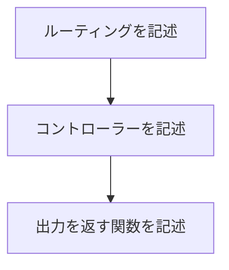

Phoenix(正式にはPhoenix Framework)とは、Elixirで開発されているWebアプリケーションを構築するためのフレームワークです。
このフレームワークを使用することで、簡単に分散と並列を活用したアプリケーションを構築できます。

PhoenixはRuby on Railsのようなアーキテクチャ(ソースは見つからなかったけど作者がRailsコミッターらしい)になっており、それに類似するDjangoやSpringのような俗に言う**MVCアーキテクチャ**になっています。

Phoenixは現在バージョン1.17に達しており、その最新のドキュメント(日本語訳済み)は[こちら](https://zenn.dev/koga1020/books/phoenix-guide-ja-1-7)で読むことが可能です。

基本的な開発の流れ

上述のドキュメントの通りに自動生成されたコードを改変するだけでオリジナルの機能を簡単に実装できます。

また、プロジェクト作成時に自動で*Phoenix LiveView*と呼ばれるElixirでインタラクティブなWebアプリケーションを作成するライブラリが導入され、**JavaScriptを用いずにリアルタイムなWebアプリケーションが構築できます。**

## Phoenix LiveView
Phoenix LiveViewはWebSocketを使ってインタラクティブなWebアプリケーションが構築できるライブラリです。

これを用いることで、従来JavaScriptを使って実装していた箇所をElixirで記述することができ、より効率的に開発を進める事ができます。

主な使用例として、Babylon.jsとPhoenixを使った[オンラインゲームの開発](https://qiita.com/GKBR/items/4f83cde368078572ad0d)などが挙げられます。