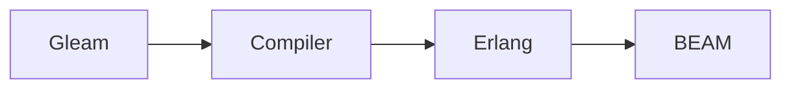

ホームページ: https://gleam.run

## 始めに
**この記事はBEAMの基礎的な知識とElixirでのプログラミング経験がある前提で書いています。**
また、主な根拠は[Gleamの公式ドキュメント](https://gleam.run/documentation/)、それぞれのパッケージの公式ドキュメントを参照しています。
**Gleamの開発は日進月歩で進んでいます**。この記事の内容が既に古くなっている事も十分に考えられるので、**必ず公式ドキュメントで裏取りを行ってください**。
もしよろしければこちらに報告してくださると嬉しいです。可能な限り対応させて頂きます。

## Gleamとは？
- 耐障害性を持つ
- 静的型付けな
- 関数型言語

## 言語処理系の概要

Rustで書かれたコンパイラによってErlangのソースに変換され、それがErlang VM(BEAM上で実行される)
この仕様により、他のBEAM系の言語との連携が簡単にできる。

## メリット
- ElixirやErlangの資産を**型付けされた状態で**扱うことができる。そのため型由来のエラーをコンパイル時に弾ける。
- Rustに近い文法なので**ALGOL系言語のユーザーでも比較的書きやすい**
- Erlang/Elixirの資産をシームレスに活用することが可能
Elixirとの連携については[逆引きGleam#Elixirと連携したい](逆引きGleam.md#Elixirと連携したい)を参照

## デメリット
- まだコンパイラのバージョンがv1.0.0に到達していない(それでもかなり速いテンポで開発が進んでいるため今後数年でv1.0.0に到達しそう)
- 情報が圧倒的に少ない。特に日本語。これは**マイナー言語の宿命**なので致し方ない

コンパイラ自体は未成熟でも、その実行環境であるBEAMはかなり成熟したランタイムなのでコンパイラ次第ではすぐに実用できる状態になれるポテンシャルがある。
